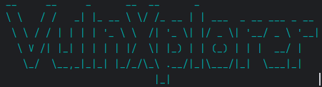
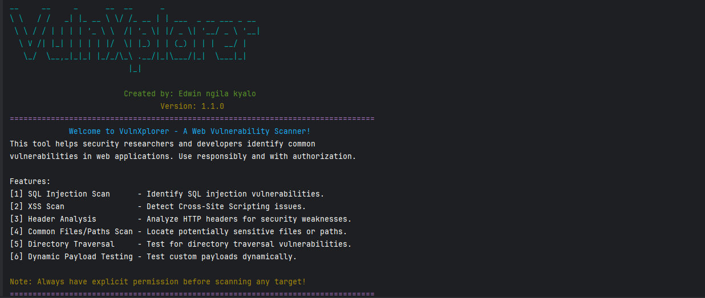
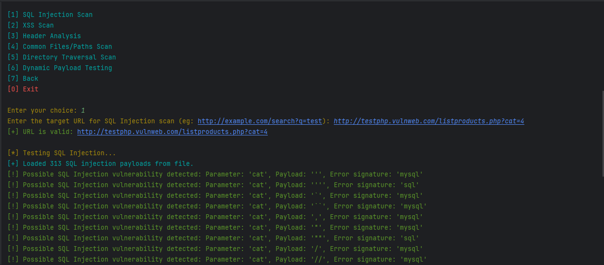
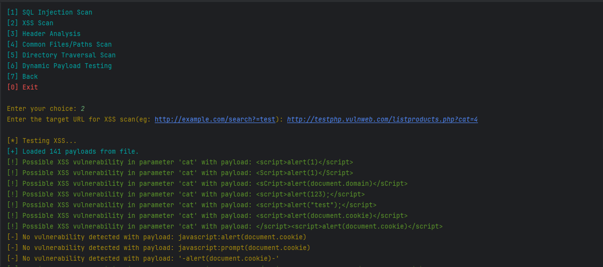
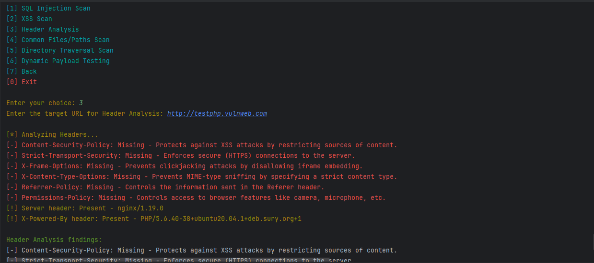
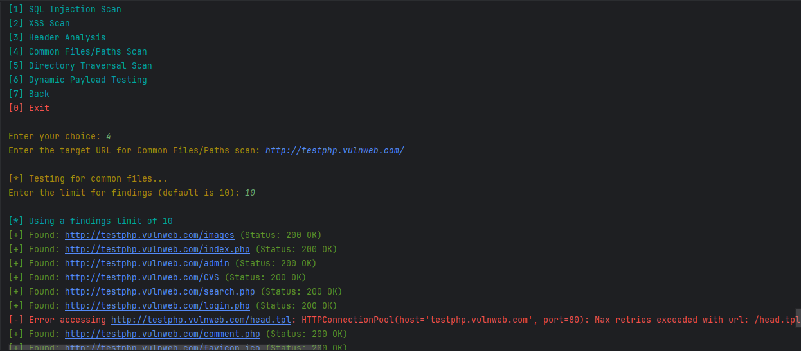

## Screenshots








# VulnXplorer

VulnXplorer is a tool that runs on a machine with a Python environment. It can be used to scan websites for vulnerabilities and alert the user if the site has any known vulnerabilities. Below is a list of vulnerabilities the tool can detect:

* **SQL Injection Scan**      - Identifies SQL injection vulnerabilities.
* **XSS Scan**                - Detects Cross-Site Scripting (XSS) issues.
* **Header Analysis**         - Analyzes HTTP headers for security weaknesses.
* **Common Files/Paths Scan** - Locates potentially sensitive files or paths.
* **Directory Traversal**     - Tests for directory traversal vulnerabilities.
* **Dynamic Payload Testing** - Tests custom payloads dynamically.


## Installation Instructions

### Step 1: Clone the Repository

1. Open your terminal or command prompt.
2. Navigate to the directory where you want to install the tool.
3. Clone the repository from GitHub:
```bash
   git clone https://github.com/edwinkimani/VulnXplorer.git
```
### Step 2: Install Dependencies 
 #### Set up a Virtual Environment (Optional but Recommended)
  You can set up a virtual environment to keep dependencies isolated.
  *  For Windows:
 ``` bash
 python -m venv venv
venv\Scripts\activate
```
* For Linux/Mac:
``` bash 
python3 -m venv venv
source venv/bin/activate
```
#### Install the Required Python Dependencies
Run the following command to install the required libraries:
``` bash
pip install -r requirements.txt
```
This will install all the required libraries such as requests, pyfiglet, and colorama.
### Step 3: Running the Tool
Once the dependencies are installed, you can start the tool by running the following command:
``` bash 
python Script.py
```
The tool will display a welcome banner and prompt you with a main menu. You can choose different options to perform various vulnerability scans.

#### Available Scan Options:
* SQL Injection Scan
* XSS Scan
* Header Analysis
* Common Files/Paths Scan
* Directory Traversal Scan
* Dynamic Payload Testing

### Step 4: Scan a Target
Once the tool is running, you can interact with the main menu by selecting the desired scan type (e.g., SQL Injection Scan or XSS Scan). The tool will then guide you through the process of entering the target URL and performing the scan.

#### Here are the available scan options:
* SQL Injection Scan: Enter a target URL (e.g., http://example.com/search?q=test) to test for possible SQL injection vulnerabilities.
* XSS (Cross-site Scripting) Scan: Enter a target URL to test for XSS vulnerabilities.
* Header Analysis: Enter the URL to check for security headers like X-Content-Type-Options, X-XSS-Protection, etc.
* Common Files/Paths Scan: Scan a target URL for common vulnerable files and paths like robots.txt, admin.php, and login.php.
* Directory Traversal Scan: Check for directory traversal vulnerabilities by testing common traversal payloads.
* Dynamic Payload Testing: Dynamically inject payloads to find vulnerabilities in real-time.

### Step 5: Example Usage
Here is an example of running the SQL Injection scan:

```bash
Enter your choice: 1
Enter the target URL for SQL Injection scan (e.g., http://example.com/search?q=test): http://example.com
[*] Testing SQL Injection...
[+] Loaded 100 SQL injection payloads from file.
[!] Possible SQL Injection vulnerability detected: Parameter: 'q', Payload: '1 OR 1=1', Error signature: 'mysql'
```
### Step 6: Optional - Update the Tool
To update the tool to the latest version, run:
``` bush
git pull origin main
```
### Step 7: Troubleshooting
#### Missing Dependencies:
If you receive errors regarding missing modules, ensure that you have installed the dependencies listed in requirements.txt:

```bash
pip install -r requirements.txt
```
#### Permission Issues:
Ensure you have permission to scan the target URL, as unauthorized scanning may violate laws or terms of service.

### Additional Information
The tool supports both Linux and Windows OS and will automatically load the appropriate wordlist based on the detected OS. Always ensure that you have explicit permission before scanning any website. Unauthorized scanning can lead to legal issues.

Feel free to reach out if you encounter any issues during the installation or usage of the tool.
